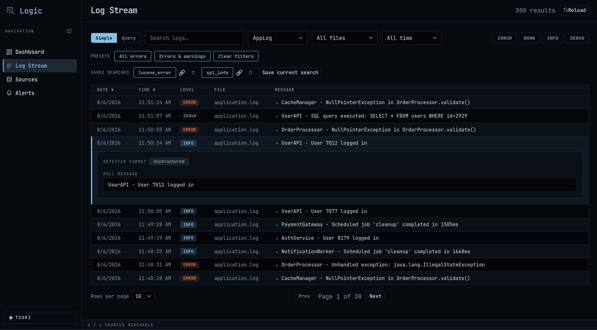
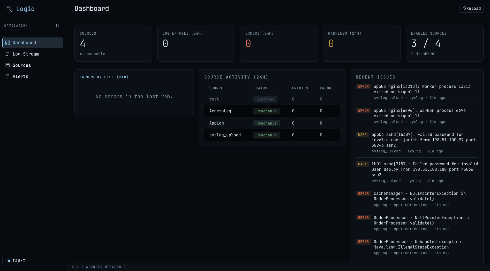
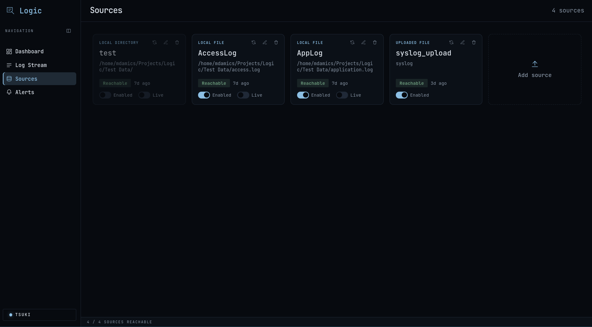

# Features

This document contains the full feature list, screenshots, and detailed explanations previously included in the root `README.md`. Use the TOC to jump to a section.

Table of contents

- [Log Stream](#log-stream)
- [Search & Query](#search--query)
- [Patterns](#patterns)
- [Alerting](#alerting)
- [Redaction](#redaction)
- [Dashboard](#dashboard)
- [Source management (Sources screen)](#source-management-sources-screen)
- [Shared Reload action](#shared-reload-action)
- [Appearance](#appearance)
- [Operational notes & env vars](#operational-notes--env-vars)

--------------------------------------------------------------------------------

## Log Stream

- Real ingestion: tails the trailing window of each source (bounded reads — 512KB / 3,000 lines per file) rather than loading it whole. Parsing includes the app's own log format, ISO-8601, Apache/Combined access logs, and BSD/RFC-3164 syslog. When a line carries no explicit level tag, the system falls back to keyword-based severity matching ("failed", "denied", "exited on signal", etc.).
- Structured/unstructured message parsing: click a row to expand it and see the full message (not just the truncated single line) alongside its auto-detected format — JSON, syslog, Apache/Nginx access log, or logfmt/key=value — broken out into its individual fields. Multiple rows can be expanded at once; anything that doesn't match a known shape shows as plain unstructured text.
- Filtering: free-text (debounced), source, file, severity (ERROR/WARN/INFO/DEBUG), and time range; one-click presets (all errors, errors & warnings, clear).
- Sortable columns: time, level, source, file; configurable rows per page (10/25/50/100); backend-side pagination.
- Live tail (push-based): while any live source is in scope (shown by a "● LIVE" indicator), the table updates via server-sent events (`GET /api/logs/stream`). The server watches for new matching entries and pushes only genuine new arrivals. Default view (Simple mode, sorted by time desc, first page) appends new rows to a virtualized, capped in-memory buffer (5,000 rows, oldest evicted first) so long-running sessions stay smooth without refetching the whole result set. If a line is edited/deleted under a tailed file, a full resync is triggered. Other views refresh via refetch rather than live splice. Connections reconnect with backoff on network/server issues.
- New-data banner: a "new data available" banner names the exact file and source when a non-live source has changed, with a one-click Reload.

--------------------------------------------------------------------------------

## Search & Query

- Embedded indexing: log entries are durably indexed using an embedded Apache Lucene index (no external service). Indexing runs in the background as sources are read and is separate from the Log Stream's live/non-live cache, enabling history beyond the trailing read window.
- Structured fields extracted from JSON, syslog, access-log, and logfmt messages are indexed as `field.<name>`, making them individually queryable and filterable.
- Query bar modes: three supported languages (selectable from a dropdown):
  - Lucene — native Lucene classic query syntax (`field:value`, boolean operators, phrases, wildcards, etc.) against `_all` or specific fields.
  - SPL (subset) — `field=value`, comparisons (`status>=500`), `AND`/`OR`/`NOT`, quoted phrases, and one aggregation stage: `| stats count by <field>` or `| stats avg|min|max|sum|p50|p95|p99(field.<name>) [by <field>]`.
  - LogQL (subset) — label selectors (`{level="ERROR"}`), line filters (`|=` contains, `|~` regex), and one aggregation stage: `count_over_time`, `rate`, or numeric stats over time buckets like `avg_over_time(field...[5m])`.
- Aggregating queries render as a bar chart in place of the row table (grouped/time-bucketed counts and rates, plus numeric-stat values).
- Trace correlation: fields that look like correlation IDs (`trace_id`, `request_id`, `correlation_id`, `span_id`, `req_id`, case-insensitive) get a "Correlate" button in the expanded row view; clicking it switches to Lucene mode and shows every log line across all sources with that value in chronological order.
- APM deep-link: when `APM_TRACE_URL_TEMPLATE` is configured, correlation fields render an "Open in APM ↗" link that substitutes the field's value into the template and opens it in a new tab (stateless link-out).
- Saved Searches: bookmark current filters (Simple mode) or query-bar strings (Lucene/SPL/LogQL + aggregation) under a name. Saved searches show as chips next to the filter bar. Click to re-run, or copy a `?savedSearch=<id>` URL that restores the filters and results.

--------------------------------------------------------------------------------

## Patterns

- Automatic clustering: an incremental, streaming template miner (a simplified Drain) tokenizes each message, masks high-cardinality tokens (numbers, UUIDs, IPs, hex blobs, quoted strings, emails, dates, mixed alphanumeric IDs) and clusters similar shapes into templates per (source, file). Opt-in per source (toggle from the Sources screen) — off by default since it adds ingest-path cost.
- Patterns screen: a sortable table (by volume or most-recently-new) with a trend sparkline, first/last-seen timestamps, and a sample raw line per template. A free-text search filters the currently loaded list by template text, sample line, or split lineage.
- Drill down: "View matching lines" jumps to Log Stream pre-filtered to that exact pattern (source + file + template ID), shown with a dismissible "Filtered by pattern" chip and further filterable by the usual search/level controls.
- Manual template management: Delete removes an over-generalized or noisy pattern — it doesn't retroactively reclassify already-counted history, so the next matching line simply mints a fresh pattern. Split re-clusters a pattern's currently-indexed lines at a stricter similarity threshold, breaking one over-generalized template into several; split-derived patterns show a "Split" badge (with the original pattern text in a tooltip and in the expanded row detail) so related patterns stay traceable to what they came from.
- Tunable clustering: the similarity threshold two message shapes must clear to merge into one template is configurable (`app.template-mining.similarity-threshold` / `TEMPLATE_MINING_SIMILARITY_THRESHOLD`, default `0.5`) rather than fixed.

--------------------------------------------------------------------------------

## Alerting

- Rules watch a query-bar query or Simple-mode filter (same scope as a Saved Search) over a rolling time window and evaluate one of:
  - Threshold — fires when the window's count (or rate) crosses a configured comparison (`>`, `>=`, `<`, `<=`, `=`) against a number. Pattern alerts are threshold rules with `count >= 1`.
  - Anomaly — fires when the window's count is > k standard deviations above the mean of configurable prior windows (statistical baseline, not ML).
  - New pattern — fires once per newly-appeared message shape on a source (per Patterns' automatic clustering) within a configurable evaluation window; patterns that already existed before the rule was created never retroactively fire. No query/search/level/metric fields apply — just a source scope and a window.
- Webhook notifications: optional per-rule URL receives a JSON payload on trigger, HMAC-SHA256-signed (`X-Logic-Signature: sha256=...`) with a per-rule secret; secrets are encrypted at rest the same way SFTP passwords are. A "test webhook" sends a synthetic payload.
- Mute/unmute: muted rules continue evaluating (history preserved) but never send webhooks.
- Trigger history: per-rule triggers include timestamp and the metric value that crossed the threshold; rules also show last-evaluated timestamps.

--------------------------------------------------------------------------------

## Redaction

- Regex-based masking rules are applied at ingest time before an entry is cached, indexed, or displayed — the raw matched text is never persisted. Off by default.
- Each rule includes: a regex pattern, an optional custom mask (default `***`), and an optional source scope (blank = global). Rules can be enabled/disabled without deletion.

--------------------------------------------------------------------------------

## Dashboard

- Stat cards: counts for total/enabled/disabled sources, reachable sources, log entries, errors, and warnings (last 24h), plus the on-disk size of the search index and the oldest retained entry.
- "Errors by file" bar chart (top files by error count, last 24h).
- Source activity table (entries/errors per source, live/enabled/status badges).
- Recent issues feed (latest errors & warnings across all sources).
- Live auto-refresh and "new data available" banner behavior similar to the Log Stream.

--------------------------------------------------------------------------------

## Source management (Sources screen)

- Supported source types:
  - Local file
  - Local directory (non-recursive, capped to 20 most recently modified files)
  - SFTP remote path
  - HTTP(S) URL
  - Uploaded file/directory (from the browser)
- Upload behavior: browser uploads (`POST /api/sources/upload`) store files under `UPLOADS_DIR` and are read like local sources thereafter. Uploads are one-time snapshots (no Live toggle) and cannot be replaced in place — delete + re-upload to change. Directory uploads are non-recursive; flatten nested folders if you need all files ingested.
- Browse…: for local file/directory sources, a server-backed picker (`GET /api/sources/browse`) lists the server's filesystem for easier path selection (server host, not browser).
- Edit, delete, and test connectivity (`UNVERIFIED` / `REACHABLE` / `UNREACHABLE`).
- Enable/disable: disabled sources are skipped by ingestion and their lines stop appearing in streams/queries/alerts; nothing is deleted from the index, so re-enabling restores immediately.
- Live toggle: re-reads enabled sources continuously (~2s) so Log Stream and Dashboard update automatically; non-live sources read once until Reloaded.
- New-data indicator: non-live sources whose files changed since last read are flagged per-file and prompt reload.

--------------------------------------------------------------------------------

## Shared Reload action

A Reload button (Log Stream and Dashboard) invalidates the ingestion cache so non-live sources are re-read on demand.

--------------------------------------------------------------------------------

## Appearance

Styled after the Axiom HUD design system: sharp shaved-corner panels (`clip-path`), mono-readout typography for timestamps and stat values, and four selectable themes:

| Theme | Look |
| --- | --- |
| NULLGRID (default) | Matte black + electric blue, dark |
| GANTRY | Bone white + safety orange, light |
| ABYSSAL | Deep navy + neon cyan, dark |
| RAVEN | Near-black + hot magenta, dark |

--------------------------------------------------------------------------------

## Operational notes & env vars

See the Security and configuration tables in the original README for full environment variables and defaults. Highlights:

- `AUTH_ENABLED` (default: `true`) — HTTP Basic auth on by default.
- `ADMIN_USERNAME` / `ADMIN_PASSWORD` — admin credentials; override before exposing beyond localhost.
- `CORS_ALLOWED_ORIGINS` — default `http://localhost:5173` for dev proxy.
- `ENCRYPTION_KEY` — Base64 32-byte AES key for SFTP password encryption (generated on first run if not supplied).
- Search index:
  - `SEARCH_INDEX_DIR` (default `./data/search-index`)
  - `SEARCH_INDEX_INTERVAL_MS` (default `5000`)
  - `SEARCH_INDEX_RETENTION_DAYS` (default `30`)
- Pattern mining:
  - `TEMPLATE_MINING_SIMILARITY_THRESHOLD` (default `0.5`) — how similar two masked-token shapes must be to merge into one pattern rather than minting a new one.

Other operational variables (upload limits, SSE poll intervals, retention purge interval, etc.) are available in the README's Security section and in `application.yml`.

--------------------------------------------------------------------------------

Notes

- Images use relative paths (e.g. `../Screenshots/...`) so they render both on GitHub and in local previews/editors.
- If you want the features doc split into multiple pages (Search, Alerting, Sources, etc.) I can supply separate files and a top-level docs index.

--------------------------------------------------------------------------------